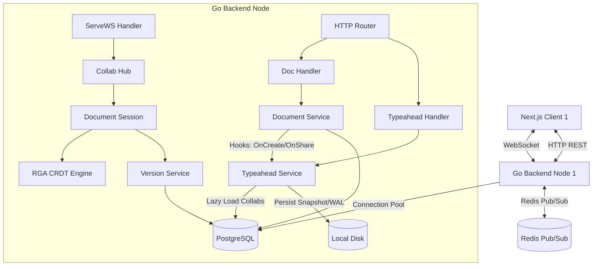
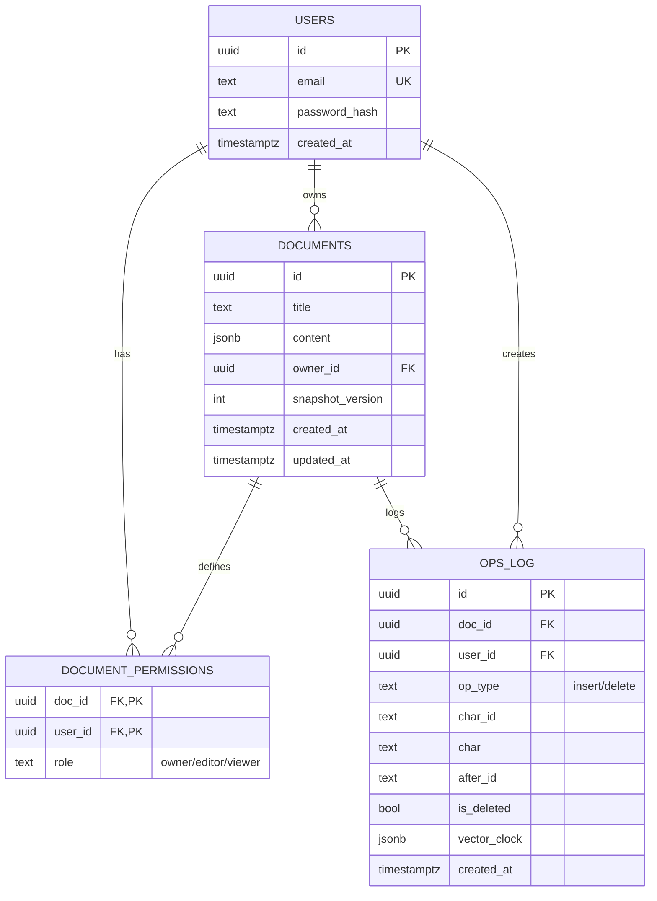

# DocStream - Real-Time Collaborative Document Editor

DocStream is a production-ready, highly scalable collaborative document editor backend (similar to Google Docs) built in **Go**, designed to synchronize concurrent edits in conflict-free real-time across multiple instances.

---

## System Architecture

DocStream uses a distributed architecture designed to coordinate concurrent client sessions, scale horizontally, and achieve eventual consistency.



### Key Components
- **API Gateway / Router**: Built using `go-chi` (v5) providing prefix-based REST routing, request ID logging, rate limiting, and CORS handlers.
- **WebSocket Upgrade Server**: Connects clients to document sessions over WebSockets using `nhooyr.io/websocket`.
- **Collab Hub**: Runs a non-blocking background select loop coordinating client registrations and asynchronous database load triggers.
- **Document Sessions**: Tracks in-memory character sequence states, active client cursors, and local socket broadcast targets.
- **Redis Pub/Sub**: Routes operational updates across backend servers, enabling multi-instance horizontal scaling.
- **Postgres Database**: Serves as the persistent store for relational users, documents, permissions, and append-only operations logs.

---

## Real-Time Synchronization: Sequence CRDT

DocStream implements a custom **Sequence CRDT (Conflict-free Replicated Data Type)** instead of Operational Transformation (OT). While OT requires a centralized server to coordinate and transform edit indices (which is hard to scale and distribute), CRDTs guarantee that document states converge to the exact same content regardless of network delays or message arrival orders.

### 1. Character Representation
Each character in the document is represented as a unique node in a list structure:
```go
type CRDTChar struct {
    ID        string `json:"id"`         // Format: "{userID}:{logicalClock}"
    Char      string `json:"char"`       // Character value (supports multi-byte Unicode/Emojis)
    AfterID   string `json:"after_id"`   // ID of the preceding character (empty if at start)
    IsDeleted bool   `json:"is_deleted"` // Tombstone marker
}
```

### 2. Globally Unique IDs
Every character is tagged with an ID of format `{userID}:{logicalClock}`:
- `userID`: Unique string identifying the client who created the edit.
- `logicalClock`: An incremental integer tracker incremented by the client for each operation.
This format guarantees globally unique identifiers without centralized coordination.

### 3. Conflict Resolution (RGA Algorithm)
When two users concurrently type after the same character, both operations have the same `afterID` (siblings). DocStream resolves this conflict using the **RGA (Replicated Growable Array)** algorithm:
- When applying an operation `newOp` after `afterID`, the engine starts scanning the character sequence immediately after `afterID`.
- It skips past any concurrent characters whose IDs are lexicographically larger than `newOp.CharID` (and skips all of their nested descendants).
- It inserts the character at the first index where these conditions break.
Lexicographical tiebreaking ensures that all nodes resolve conflicts identically, ensuring convergence.

### 4. Tombstone Deletes
When a user deletes a character, the character is **not** removed from the memory slice. It is marked as `IsDeleted = true` (tombstone). Preserving deleted elements is necessary because concurrent operations from other users might still reference them in their `afterID` links.

---

## Database Architecture & Schema

We follow an append-only architecture for editing events. The server never mutates old operations; it only appends to `ops_log` and captures periodic snapshots.



### Snapshotting Mechanism
Replaying thousands of individual operations from the beginning to construct a document is expensive. To optimize reload times:
1. Every operations update is written to `ops_log`.
2. When the count of operations written since the last snapshot exceeds **100**, the server serializes the in-memory `CRDTDoc` (including tombstones) to JSON.
3. This JSON is saved into `documents.content`, and `documents.snapshot_version` is incremented.
4. When a new client connects, the server loads the snapshot and replays only the few incremental operations logged *after* the snapshot timestamp.

---

## Multi-Instance Scaling (Redis Pub/Sub)

To scale beyond a single server instance, DocStream synchronizes nodes using Redis Pub/Sub:
- When a document session starts on a node, it subscribes to the Redis channel `doc:{docID}`.
- When a local client submits an operation, the server persists it to PostgreSQL and publishes the operation to the Redis channel.
- Other servers receive the operation, apply it to their local session in-memory (skipping Postgres writes since the original server already did so), and broadcast it to their connected local sockets.
- **Echo Loop Prevention**: Each server generates a unique UUID `instanceID` on startup. Published Redis messages are wrapped with the sender's `instanceID`. Subscribed nodes drop messages matching their own `instanceID` to avoid duplicate processing.

---

## Presence & Cursor Tracking

DocStream tracks collaborative session states strictly in-memory:
- **Cursors**: Client positions are updated in-memory via `MsgTypeCursor` socket messages and fanned out to peer connections.
- **Presence**: Client join/leave actions trigger `MsgTypePresence` broadcasts.
- **Deterministic Color Assignment**: To prevent sharing color state, each user is assigned a deterministic CSS color by hashing their `userID` and index-mapping it to a curated color palette:
  ```go
  func GetDeterministicColor(userID string) string {
      var hash uint32 = 5381
      for i := 0; i < len(userID); i++ {
          hash = ((hash << 5) + hash) + uint32(userID[i])
      }
      colors := []string{"#E02424", "#3F83F8", "#0E9F6E", "#D03801", "#7E3AF2", "#ECE513", "#06B6D4", "#EC4899"}
      return colors[hash % uint32(len(colors))]
  }
  ```

---

## Typeahead & Autocomplete Engine

DocStream incorporates an in-process, high-performance **Typeahead/Autocomplete Engine** directly integrated into the backend core (eliminating any microservice/gRPC overhead). It supports prefix matching, fuzzy typo-tolerance, write-ahead durability, and strict permission-based security.

### 1. Engine Core (`pkg/trie` & `pkg/persistence`)
* **Trie Structure**: Handles UTF-8 weighted prefix matches, using a `sync.RWMutex` to allow concurrent, non-blocking reads (`Suggest`/`FuzzySuggest`) while serializing writes (`Insert`/`Select`).
* **LRU Eviction & Pruning**: Memory is strictly bounded. When the `maxWords` limit is reached, the least recently selected words are evicted, and empty/orphaned nodes are pruned recursively up the tree.
* **Fuzzy Matching**: Implements typo-tolerance for edit distance 1 (substitutions, insertions, deletions, and transpositions) via recursive subtree traversal.
* **Write-Ahead Log (WAL) & Snapshotting**: Mutating operations are appended to a WAL log and synced to disk. When the write count reaches a threshold or a periodic interval (e.g., 5 minutes) expires, the Trie states are exported in LRU order and saved as an atomic JSON snapshot, truncating the WAL.

### 2. Dual-Index Architecture
DocStream runs two completely independent Trie + PersistenceManager pairs with distinct growth budgets:

#### A. Global Document Titles Index
* **Purpose**: Allows users to quickly autocomplete document titles.
* **Storage**: Document titles are stored in the global Trie formatted as `<title>|<doc_id>`.
* **Access Control (Paginating-before-Filtering prevention)**: To prevent info leaks where users discover titles of documents they cannot access, title queries run an **Adaptive Search Loop**. The handler queries the Trie for candidates, parses the `doc_id`, runs a single bulk SQL check (`docRepo.HasAccessToDocs`) against document permissions, and filters out unauthorized entries. If the allowed results fall short of the requested limit, the loop adaptively queries larger candidate pools from the Trie (doubling up to `1000`) before final response framing.

#### B. Per-Document Collaborator Mentions Index
* **Purpose**: Scopes `@-mention` autocomplete list to collaborators of the active document, ranked by local selection frequency.
* **Lazy Loading**: Instead of performing full user table scans at boot, the mention Trie is loaded lazily when the document is first opened/edited (loading collaborators from the DB and recovering frequency counts from `data/typeahead/mentions/{docID}_*`).
* **Concurrence & Janitor Unload**: A background janitor periodically (e.g., every 10 minutes) unloads inactive mention Tries after 30 minutes of idle time. To prevent TOCTOU race conditions:
  * Evicted Tries are marked as `Closing`.
  * Concurrent client requests checking the cache will detect the `Closing` state, release global locks, wait on a synchronization channel (`<-mt.Closed`), and then reload cleanly.
  * The janitor calls `PM.Close()` to flush any un-checkpointed selections to disk before deleting map references and closing the channel.
  
### 3. Fault-Tolerant Async Writes
All typeahead mutation hooks (such as indexing new titles on creation or registering selections) are executed asynchronously in background goroutines:
* Wraps insertions in a bounded retry loop (3 attempts with exponential backoff).
* Logs warnings on intermediate failures and errors on permanent failures.
* Increments a thread-safe atomic counter `failedWrites` for observability.

---

## Production Hardening & Security

- **Token Bucket Rate Limiting**: The server uses a custom thread-safe token bucket middleware, limiting clients to **100 requests per minute per IP address**.
- **CORS Guards**: Preflight options and requests are restricted to the configured Next.js domain (`ALLOWED_ORIGIN`).
- **Request ID Tracking**: Chi injects a unique correlation ID (`X-Request-Id`) into request and response headers.
- **Graceful Shutdown**: Catches termination signals (`SIGINT`, `SIGTERM`), halts the HTTP listener, drains active connection pumps, flushes Postgres connection pools, and closes Redis clients.

---

## Project Structure

```
DocStream/
├── Dockerfile              # Root Dockerfile for the Go backend
├── README.md               # Architecture and system design specifications
├── .gitignore              # Global git ignore filters
├── backend/                # Go collaborative backend application
│   ├── cmd/server/         # main.go startup entrypoint
│   ├── internal/           # Decoupled application modules (auth, document, collab, version, user, typeahead)
│   ├── pkg/                # Generic utility packages (db, config, logger, errors, middleware, trie, persistence)
│   ├── migrations/         # SQL migration scripts
│   ├── docker/             # Local infrastructure (docker-compose postgres/redis)
│   └── Makefile            # Run, test, and migration scripts
└── frontend/               # Next.js collaborative editor application
```

---

## Running Locally

### 1. Infrastructure Setup
Spin up PostgreSQL and Redis containers using Docker Compose:
```bash
cd backend
make docker-up
```

### 2. Configure Environment
Create a `.env` file inside the `backend` directory copying [.env.example](file:///c:/Users/family/OneDrive/Desktop/DocStream/backend/.env.example):
```bash
cp .env.example .env
```
Ensure `DATABASE_URL` and `REDIS_URL` credentials match the docker configuration.

### 3. Run Database Migrations
Apply SQL schemas to the PostgreSQL container:
```bash
make migrate-up
```

### 4. Run backend
Start the Go application server:
```bash
make run
```

### 5. Running Tests
Run CRDT sequence unit tests and WebSocket collaboration integration tests:
```bash
make test
```
